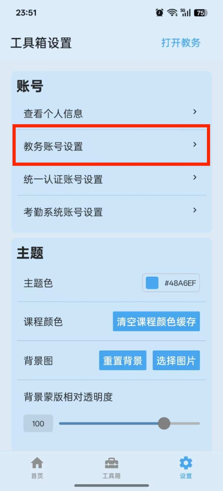
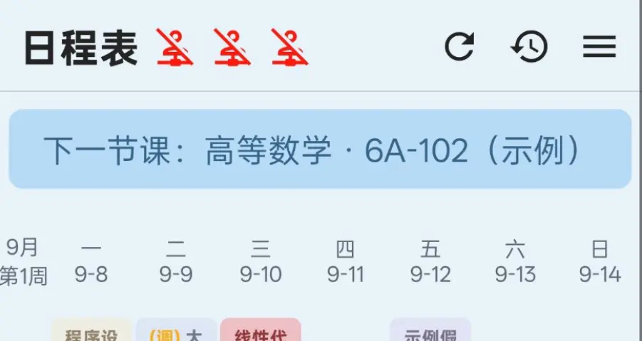
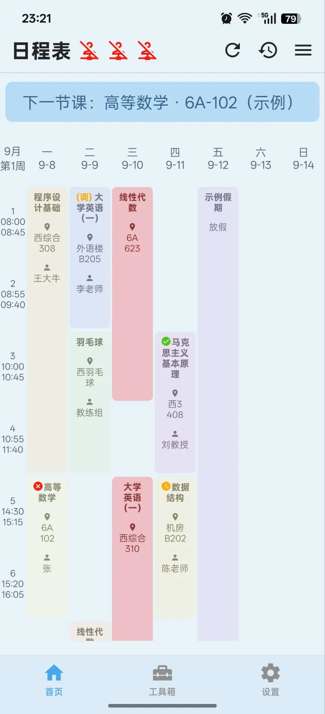
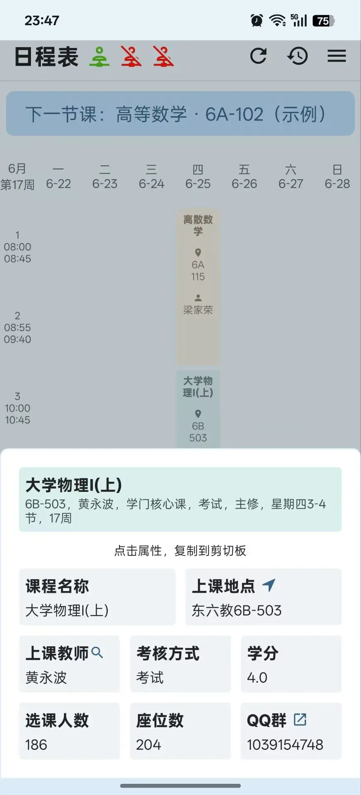

# 基础教程

## 登录

首次使用时，需要设置相关账号才能正常使用各项功能。APP 需要用到三个独立的账号系统，分别对应不同的功能模块。

### 教务账号设置

教务账号是使用大部分核心功能（课表查询、考试信息、成绩查询、选课信息等）的前提。

**操作步骤：**

1. 打开 APP → 底部标签栏点击「设置」
2. 点击「教务账号设置」进入登录页面

3. 在「学号」输入框中输入你的教务系统学号
4. 在「密码」输入框中输入教务系统密码（输入时默认隐藏，可点击右侧眼睛图标切换显示/隐藏）
5. 点击「登录」按钮

**登录状态说明：**

页面顶部会显示当前登录状态，以彩色圆点和文字标识：

| 状态 | 圆点颜色 | 文字说明 |
|------|----------|----------|
| 未配置账号 | 灰色 | 未配置账号 |
| 已保存但未登录/已失效 | 黄色 | 已保存账号（未登录/已失效） |
| 已登录 | 绿色 | 已登录 |

登录成功后，页面会显示绿色的成功提示横幅；登录失败则显示红色的错误提示横幅，说明失败原因。

**其他操作：**

- 点击「打开教务登录页」按钮，可以在内置浏览器中打开教务系统登录页面，方便手动操作
- 底部有提示文字：「仅供工具从教务系统获取信息」以及「23:00 至次日 7:30 请连接校园网」

::: warning 注意
23:00 至次日 7:30 期间，学校教务系统仅限校园网访问。在此时间段使用非校园网将无法登录。
:::

### 统一认证系统账号设置

部分功能（如学校文件查阅）需要统一认证系统的账号。

**操作步骤：**

1. 设置 → 点击「统一认证账号设置」
2. 输入统一认证系统的账号和密码
3. 完成登录

### 考勤系统账号设置

如需使用考勤信息查询功能，需要设置考勤系统账号。

**操作步骤：**

1. 设置 → 点击「考勤系统账号设置」
2. 输入考勤系统的账号和密码
3. 完成登录

::: tip 提示
首次进入考勤信息查询页面时，如果考勤系统 Token 已过期，APP 会自动弹出快速登录弹窗，需要输入验证码完成登录。
:::

## 首页

首页是打开 APP 后的第一个页面，核心是日程表。

### 账号状态指示

首页标题「日程表」左侧有三个小图标，分别对应三个账号系统的登录状态：

- **绿色图标**：该系统已登录
- **红色图标**：该系统未登录或已失效

点击图标区域可以展开底部菜单，查看详细的账号状态和设置。

### 下一节课提示

课表上方会显示「下一节课」的提示信息，包含课程名称和上课地点，例如：

> 下一节课：高等数学 · 6A-102

如果没有课程安排，会显示示例占位文字。此功能帮助你快速了解接下来要上什么课。

### 日程表课表

日程表是首页的核心功能，以表格形式展示一周的课程安排。

**课表结构：**

- 左侧为时间轴，显示节次和对应的时间段
- 顶部显示周一到周日的日期
- 课表中每个课程块显示课程名称和上课地点
- 自动适配当前周目，高亮显示今天的日期和当前时间段

**基本操作：**

| 操作 | 方式 |
|------|------|
| 切换周数 | 左右滑动课表 |
| 返回当前周 | 点击右上角时钟图标（不在当前周时显示） |
| 刷新课表 | 点击右上角刷新按钮，从教务系统手动更新课表和考试信息 |
| 打开菜单 | 点击右上角菜单按钮（三条横线图标） |
| 查看课程详情 | 点击课表上的任意课程块 |

**课程块的类型：**

课表中会显示四种类型的项目：

1. **课程**：常规课程，显示课程名称和地点
2. **考试**：当教务系统上有考试安排时，考试信息会自动填充到对应日期，标记为「考试」
3. **调课标记**：发生过调课的课程，会显示特殊标记
4. **冲突课程**：同一时间段有多门课程时，会以堆叠形式显示，可以左右滑动切换查看

**课程详情弹窗：**

点击课程块后会弹出底部详情面板，显示以下信息：

- 课程名称（带颜色标记的卡片）
- 上课地点（点击地点名称可跳转地图导航）
- 上课教师（点击教师名字旁的放大镜图标可查看教师详细信息）
- 考核方式
- 学分
- 选课人数
- 座位数
- QQ 群号（点击可直接跳转 QQ 加群，如跳转失败会自动复制群号到剪贴板）
- 相关考试信息（如有，显示考试时间、地点、座位号、距今天数）

**提示**：点击任意属性项可以将其内容复制到剪切板。

### 实践课列表

课表下方会显示物理实验课、金工实训等实践课程的列表（如有）。

### 底部菜单

点击右上角菜单按钮或首页标题左侧的账号状态图标，可以打开底部菜单，包含以下选项：

**账号状态区域：**

显示三个账号系统的详细登录状态：
- 教务系统
- 统一认证系统
- 考勤系统

**功能选项：**

| 选项 | 说明 |
|------|------|
| 事件编辑 | 进入日程编辑页面，可添加/编辑自定义日程 |
| 分享课表 | 将当前周的课表生成图片分享 |
| 课表设置 | 打开课表设置面板 |

### 课表设置

点击「课表设置」后进入设置面板，可以调整以下内容：

**显示内容：**

可以切换课程块上显示的信息：
- 课程名称（默认开启）
- 上课地点（默认开启）
- 教师名称（默认开启）

选中的项目会以高亮色显示，点击可切换开关状态。

**课程元素高度：**

通过滑动条调整课程块的高度（范围 5 - 100）。数值越大，课程块越高，可以显示更多信息。

**学期设置：**

- **学期选择**：选择要查看的学年和学期（支持选择第一学期、第二学期、第三学期）
- **起始日**：设置学期的起始日期，课表会根据此日期计算周数

**当前周数：**

通过滑动条直接跳转到指定周数（第 1 - 20 周）。

**配色风格：**

选择课表的配色方案：
- **经典**：默认配色方案
- **马卡龙**：柔和的糖果色系
- **莫兰迪**：低饱和度的高级灰色系
- **鲜明**：高对比度的鲜艳色系

每种配色会显示预览色块，选中的配色以边框高亮标识。

## 底部标签栏

应用底部有三个主要标签页：

| 标签 | 图标 | 说明 |
|------|------|------|
| 首页 | 房子图标 | 查看课表和日程安排 |
| 工具箱 | 工具箱图标 | 各类教务信息查询工具的集合 |
| 设置 | 齿轮图标 | 账号管理、主题个性化、软件信息等 |

每个标签页顶部（首页除外，首页在右上角菜单中）都有「打开教务」按钮，点击可快速跳转至教务系统网页版。

## 更新通知

首页顶部会显示应用更新通知卡片，当有新版本发布时会提示用户更新。点击更新按钮可以下载并安装最新版本。
