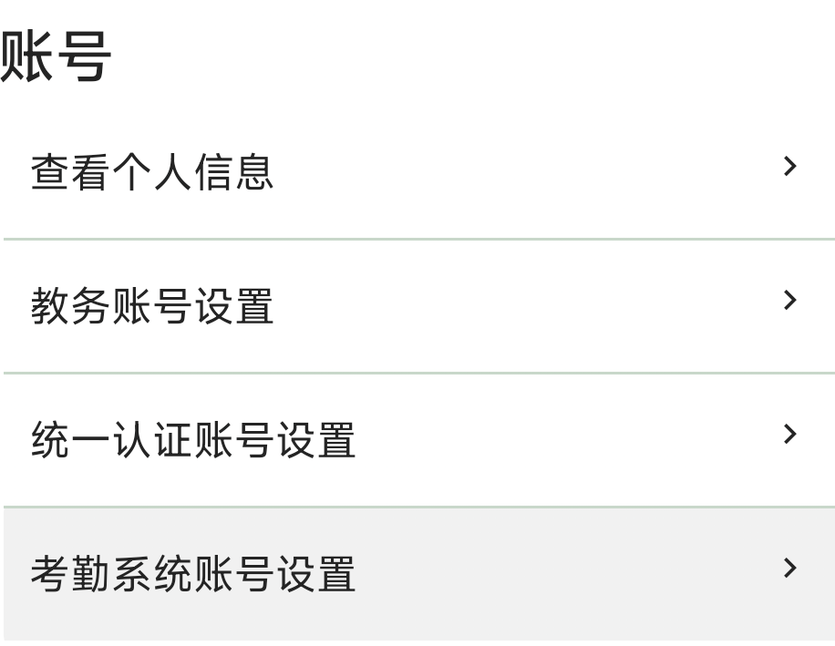
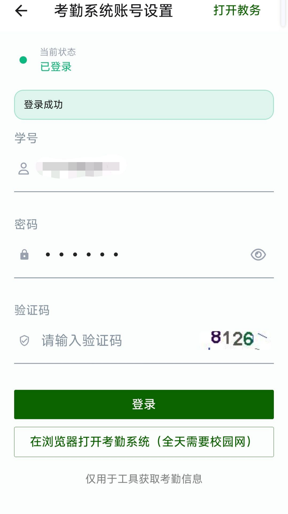

# 账号设置
## 概要
用于设置各类账号

## 查看个人信息
点击「查看个人信息」可以查看在教务系统中登记的个人基本信息。

**显示内容：**

- 学号
- 姓名
- 学院
- 专业
- 年级
- 班级
- 其他教务系统中的个人信息  

信息以列表形式逐行显示，左侧为字段名称（灰色），右侧为对应的值（黑色加粗）。

**加载状态：**

- 加载中：显示加载动画和「加载中....」提示
- 无数据：显示「暂无个人信息，请检查教务系统登录状态」
- 加载完成：显示所有个人信息列表

::: tip 提示
需要先登录教务账号才能查看个人信息。如显示「暂无个人信息」，请先到「教务账号设置」完成登录。
:::

## 教务账号设置
用于设置工具箱使用的教务账号，也可打开教务网页直接登录。

::: tip
 在工具箱自动登录失败时，在这个页面手动登录。
:::

  

在这个页面有以下几个信息需要提供：

- 账号：同教务系统登录填写的账号，一般为学号。
- 密码：同教务系统登录填写的账号密码，默认为学号。**第一次登录时，教务系统会要求修改密码，此时请点击“打开教务登录页”或者自行前往教务系统网页端登录修改密码。**

完成信息设置后，点击“登陆”按钮，等待一段时间后，上方显示“登陆成功”后便能使用工具箱大部分教务系统工具。工具箱会将账密信息保存到本地，用于自动登录。

::: info
工具箱自动登录经常无法正常使用，此时请来到这个页面手动登录。
:::

以下是常见的错误情况的：

1、学号输入错误。
2、与统一认证账密记混。

## 统一认证账号
仅用于登录工具箱统一认证账号。  

::: info
工具箱自动登录经常无法正常使用，此时请来到这个页面手动登录。
:::  

  

该界面所需要提供信息：  

- 账号：同广西大学官网办事大厅账号，一般为学号。  
- 密码：初次登录密码为身份证后六位，初次登录会要求修改密码。 **初次登录请前往广西大学官网登录**

完成信息设置后，点击“登陆”按钮，等待一段时间后，上方显示“登陆成功”后工具箱会将账密信息保存到本地，用于自动登录。

## 考勤账号设置
用于设置考勤系统账号，也可打开考勤系统。（可直接在本界面登陆）  

  

该界面所需提供信息：  
- 账号：一般为学号。
- 密码：初始为身份证后六位。

:::tip
 登录**教务账号**跟**统一身份认证**均可获取**课程**信息
:::

::: warning 注意事项
- 所有账号密码仅保存在本机，不会上传至任何云端服务器
- 请妥善保管自己的账号信息，不要将账号提供给他人
- 学校教务系统在每日 23:00 至次日 7:30 仅限校园网访问
:::
