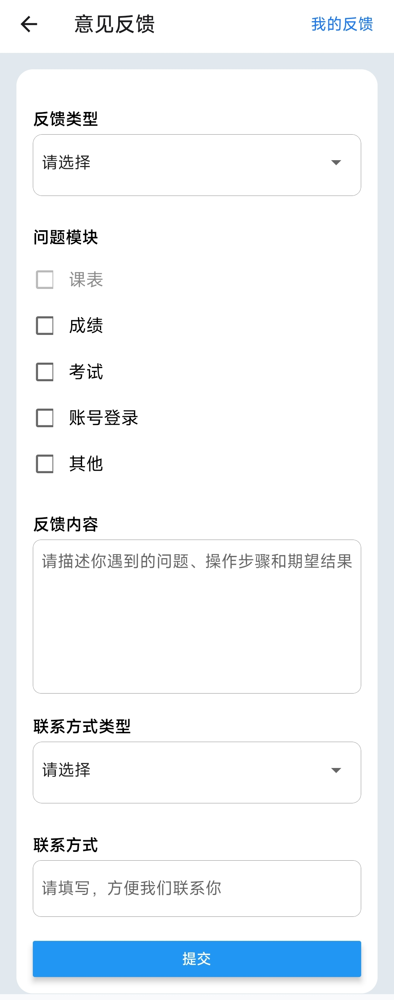
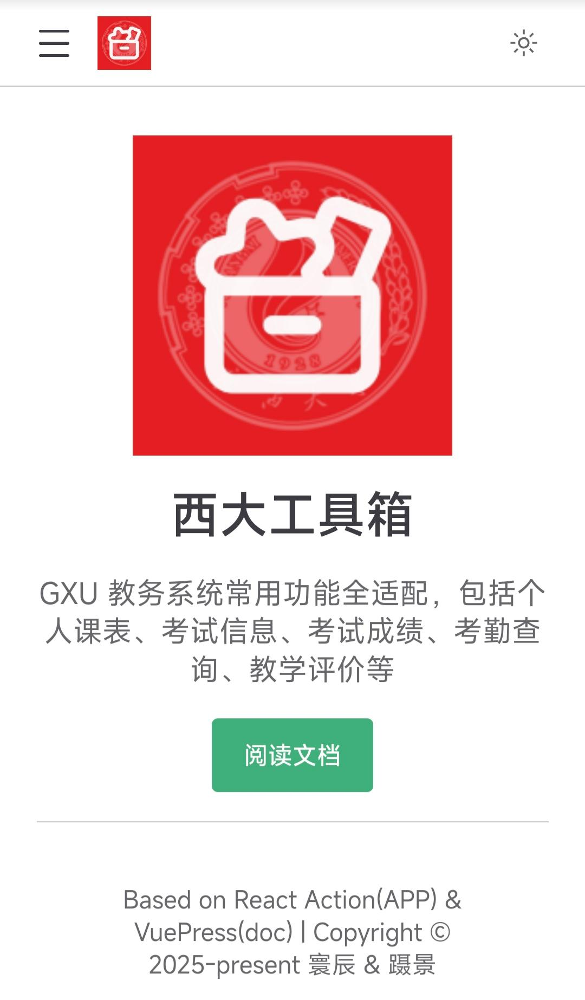

# 软件信息
## 概要

## 意见反馈
有任何修改意见，期望功能，APPbug可在此反馈。
点开后为此界面：

需要填写信息：  
反馈类型：属于哪类建议。  
问题模块：问题所在模块。  
反馈内容：请详细填写，便于我们提供更好的使用体验。  
联系方式类型：QQ，微信，邮箱。  
联系方式：填写对应类型的联系方式。  

:::tip
有修改意见也可直接在QQ群内反馈。
:::

## 代码版本号

显示当前安装的应用版本号（如「2.1.2 beta」）。在反馈问题时建议提供此信息，方便开发人员定位问题。  

## 源代码
本app的代码库，点击可打开代码库网站.

  

:::tip
有意了解者，可联系开发人员。
:::

## 软件文档
点击跳转至APP的使用说明文档。

  

## 公测群
本APP公测群QQ号。  
点击跳转至本APP公测QQ群。  

:::tip
可在本群内联系开发人员。
:::

## 版权信息和开发者联系方式
版权声明。  

开发者联系方式：  
> 寰辰 <UNDERLR@foxmail.com>  
> 蹑景 <nieying58@gmail.com>

