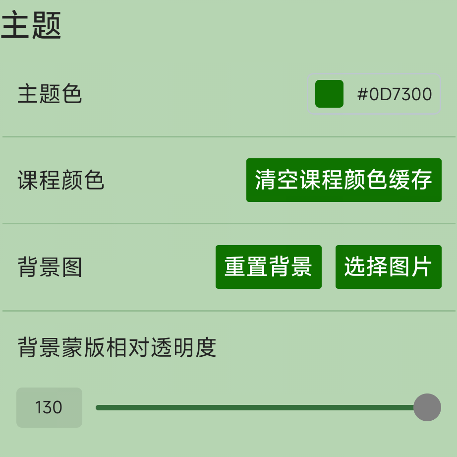
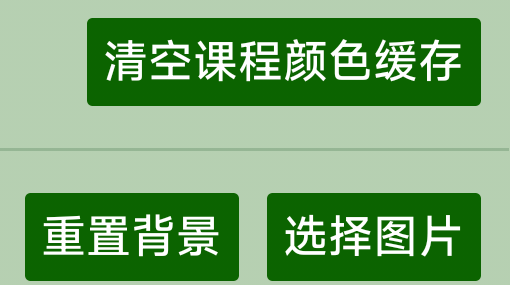
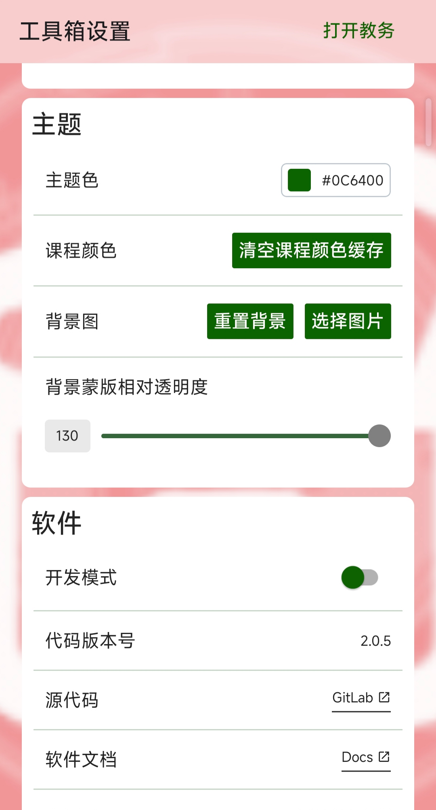

# 主题设置
## 概要
用于设置主题显示

## 主题色设置
用于更改APP主题颜色。  
一般用于:  
按钮

  

信息高亮

如：设置成绿色  

    

该功能为手动调色:

## 课程颜色
点击「清空课程颜色缓存」按钮，可以重置课表中各课程的自定义颜色。

## 背景图设置
用于更改APP背景图  
  

初始为纯白：  

选择图片:选择目标背景图。  
如改成App图标后：  

  

重置背景后APP背景图重置为纯白背景。

## 背景透明度设置
用于改变背景图透明度  

::: tip
数值越小背景图越实，数值越大背景图越虚。
:::

  

数值最小(拉到0)：  

  

数值最大(拉到130)：  

