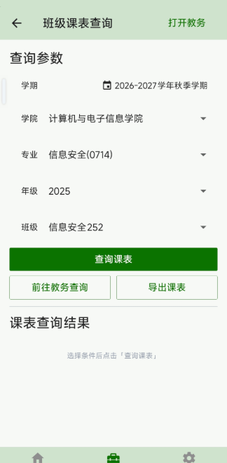
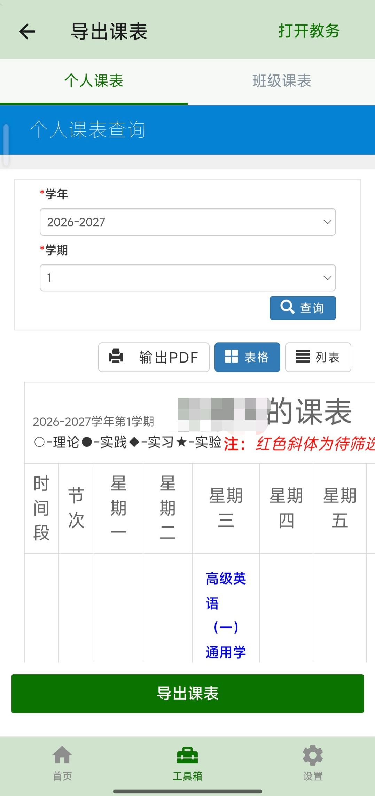
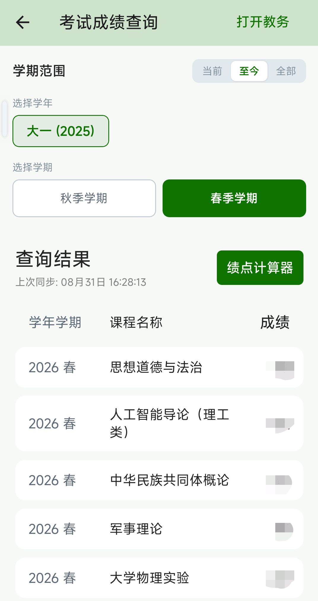
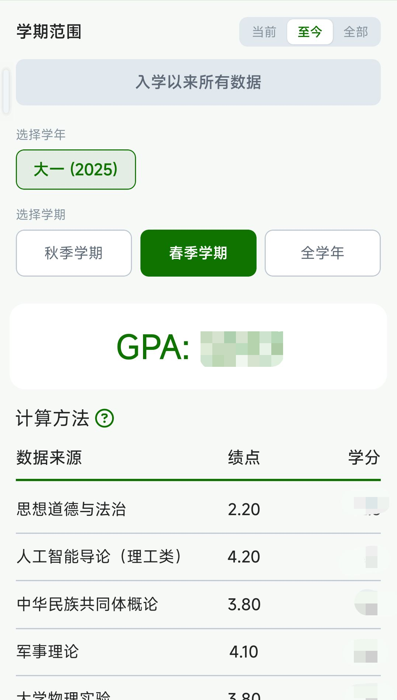
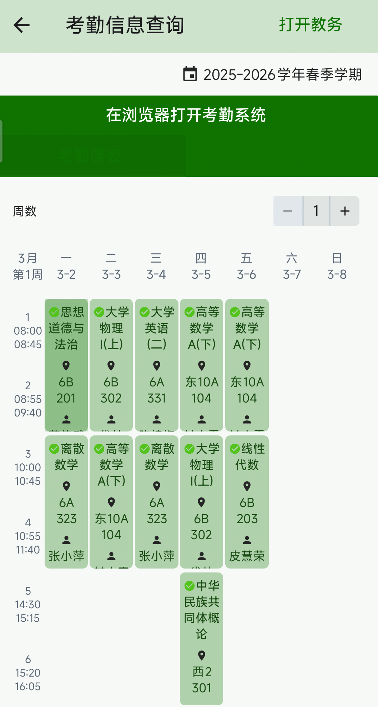

# 信息查询

## 个人课表查询

进入工具箱 → 信息查询 → 课表，可以查询指定学期的个人课表。

**操作步骤：**

1. 进入页面后默认显示当前学期的课表
2. 点击顶部的学期选择器，可以切换学年和学期
3. 左右滑动查看不同周数的课程安排
4. 点击任意课程块查看详细信息
5. 底部可查看部分课程QQ群

查询结果以与首页日程表相同的形式呈现，支持查看课程详情、教师信息等。

## 班级课表查询

进入工具箱 → 信息查询 → 班级课表，可以查询指定班级相应学期的课表。  

**操作步骤：**

1. 选择查询的学年和学期
2. 选择要查询的班级
3. 查看班级课表

查询结果以与首页课程表相同的形式呈现，方便了解同班同学的课程安排或查看其他班级的课表。

## 导出课表

进入工具箱 → 信息查询 → 导出课表，可以将教务系统上的课表页面导出为 HTML 文件，方便保存和分享。

**操作步骤：**

1. 进入页面后，顶部有两个标签页可供切换：
   - **个人课表**：导出自己的个人课表
   - **班级课表**：导出班级课表
2. 页面中间会加载教务系统的课表页面（WebView 内嵌）
3. 等待页面加载完成（底部按钮变为可点击状态）
4. 点击底部「导出课表」按钮
5. 系统会获取页面内容并保存为 HTML 文件，随后自动调用系统打开方式

::: tip 提示
导出的课表是教务系统原始页面的 HTML 文件，可以在浏览器中打开查看。由于是网页形式，保留了原始的排版和样式。
:::

## 考试考场查询

进入工具箱 → 信息查询 → 考试考场，可以查询考试安排和考场信息。

**操作步骤：**

1. 顶部选择查询的学年和学期（默认为当前学期）
2. 系统自动查询并显示考试信息列表
3. 每页显示 15 条记录，可通过底部页码输入框切换页数

**考试状态标签：**

每条考试信息卡片右上角会显示状态标签：

| 标签 | 颜色 | 含义 | 排序规则 |
|------|------|------|----------|
| 即将开考 | 绿色 | 考试尚未开始 | 按时间升序排列（最近的在前） |
| 时间未知 | 黄色 | 考试时间尚未确定 | 排在即将开考之后 |
| 已结束 | 灰色 | 考试已经结束 | 按时间降序排列（最近的在前） |

**考试信息卡片包含：**

- **课程名称**：卡片顶部居中显示，字号较大
- **考试时间**：以时钟图标标识，显示具体考试日期和时间段
- **考试地点**：以建筑物图标标识，显示教室名称
- **座位号**：以座位图标标识（仅未开考的考试显示，已结束的考试不显示座位号）
- **考试类型**：卡片底部灰色小字显示（如「期末考试」等）

**缓存机制：**

查询结果会自动缓存在手机中，下次打开页面时会先显示缓存数据，无需等待网络请求。适合考试前即用即查。

::: tip 提示
考试信息除了在此页面查看外，也会自动同步到首页日程表中，在对应的考试日期显示考试标记。点击日程表中的考试可以查看相同的信息。
:::

## 考试成绩查询

进入工具箱 → 信息查询 → 考试成绩，可以查询自己的考试成绩。

**操作步骤：**

1. 顶部选择查询的学年和学期（默认为当前学期）
2. 系统自动查询并显示成绩列表
3. 每页显示 15 条记录，可通过底部页码输入框切换页数

**成绩显示规则：**

- 考试成绩按发布时间降序排列，最后发布的在最前面
- **考试成绩不足 60 分的，在查询结果栏呈红色**（包括学年、课程名称、成绩三个字段），方便瞬间定性看挂科情况
- 未出分的科目会单独显示在页面底部的「未出分科目」区域，以标签按钮形式展示

**成绩列表结构：**

顶部固定显示表头：学年 | 课程名称 | 成绩

每行显示：
- 学年学期
- 课程名称
- 考试成绩（数值）

**查看成绩详情：**

点击任意成绩行，可以展开查看详细信息：

- **平时成绩**：各项平时成绩的名称、占比和得分（如「平时成绩1（20 %）」→「85」）
- **成绩发布时间**
- **学分**
- **绩点**
- **教师姓名**

展开时会异步加载平时成绩数据，加载过程中显示「正在加载中……」。如果加载失败，会显示红色错误提示。

**绩点计算器入口：**

查询结果区域的右侧有「绩点计算器」按钮，点击可跳转到 GPA 计算器页面，方便在查看成绩的同时计算绩点。

::: warning 重要提醒
考试成绩以广西大学教务系统显示为准。如对成绩有疑问，请及时联系任课教师或教务处核实。
:::

### 绩点计算器

进入工具箱 → 信息查询 → 考试成绩，查询页面底部有「绩点计算器」按钮，点击可进入 GPA 计算器。

**操作步骤：**

1. 选择要计算的学年和学期（默认显示全部学期）
2. 系统会自动获取该学期的所有成绩数据
3. 页面顶部大字显示计算出的 GPA 值（保留三位小数）
4. 下方列表显示每门课程的数据来源（课程名称）、绩点和学分

**计算方法：**

点击「计算方法」旁的问号图标，可以查看详细的计算公式说明。计算依据为《广西大学普通本科学生课程修读、考核及成绩管理办法（2019年修订）》：

- **课程学分绩点** = （课程考核成绩 ÷ 课程考核满分值 × 100）/ 10 - 5
- 不及格课程的学分绩点为零
- **平均学分绩点** = Σ（课程学分绩点 × 取得的课程学分 × K）/ Σ 修读课程学分
- 其中 K 为课程系数，无特别说明时取值为 1

::: warning 注意
绩点 计算器的计算结果仅供参考，实际绩点以教务系统显示为准。
:::
::: tip 提示
此功能的计算结果基于教务系统中的数据，仅供参考。实际毕业资格以学校教务处审核为准。培养方案可能有调整，系统匹配的方案可能不完全准确。
:::

## 考勤信息查询

进入工具箱 → 信息查询 → 考勤信息，可以查看需要打卡机打卡的课程的出勤状态。

**前置要求：**

使用此功能前需要先在设置中配置考勤系统账号。首次进入页面时，如果考勤系统 Token 已过期，会自动弹出快速登录弹窗，需要输入验证码完成登录。

**页面布局：**

顶部有学期选择器，可以选择要查看的学年和学期。下方有「在浏览器打开考勤系统」按钮，可跳转到考勤系统网页版。

页面主体区域有两个标签页，可左右滑动切换：

### 考勤课表

以课表形式展示每周的考勤课程安排。

**操作步骤：**

1. 顶部选择周数（默认为当前周）
2. 课表自动显示该周每天的考勤课程
3. 下拉刷新可更新数据

**考勤状态颜色标识：**

| 颜色 | 含义 |
|------|------|
| 🟢 绿色 | 已打卡成功（正常出勤） |
| 🔴 红色 | 缺勤 |
| 🟡 黄色 | 迟到 |
| 🔵 蓝色 | 未到上课时间 |

每个课程块上会显示考勤状态图标，方便一眼识别出勤情况。

**同步机制：**

考勤数据会自动同步到首页日程表中，可以在首页查看当天课程的考勤状态。

### 考勤记录

以表格形式展示详细的考勤打卡记录。

**表格列说明：**

| 列名 | 说明 |
|------|------|
| 日期 | 打卡日期 |
| 课程名称 | 对应的课程 |
| 状态 | 出勤状态（带颜色标识和图标） |
| 打卡时间 | 具体的打卡时间，未打卡显示「-」 |
| 周时间 | 第几周、星期几 |
| 教室 | 上课教室 |
| 节次 | 上课节次 |

**分页浏览：**

- 每页显示 20 条记录
- 顶部和底部都有页码输入框，可手动输入页码跳转
- 显示「第X/Y页，共有Z条结果」的汇总信息

**下拉刷新：**

在考勤记录页面下拉可以刷新数据。刷新时会先检查考勤系统 Token 是否有效，如已过期会自动弹出登录弹窗。

::: warning 注意
考勤数据来源于学校考勤系统，可能存在同步延迟。如有考勤异议，请以学校官方考勤记录为准，并及时联系任课教师或相关管理部门核实。
:::

## 选课课程列表

进入工具箱 → 信息查询 → 选课课程列表，能够查询各门课程的选课情况。

**操作步骤：**

1. 输入课程名称关键词（可选，留空则查询全部）
2. 选择课程类型：
   - 主修课程
   - 体育分项
   - 特殊课程
   - 通识选修课
   - 其他特殊课程
3. 点击「查询」按钮

**查询结果说明：**

查询结果按课程分组显示，每门课程的卡片包含：

- **课程代码**：课程的唯一标识
- **课程名称**：课程的中文名称
- **教学班数量**：该课程包含的教学班个数
- **已选人数**：所有教学班的已选课总人数
- **学分**：该课程的学分
- **课程标签**：课程的分类标签（如通识选修课的具体分类）

页面底部会汇总显示：「共有 X 门课程，Y 个教学班」。

## 校选课查漏

进入工具箱 → 信息查询 → 校选课查漏，是一个计算校选课学分是否达标的功能。

**功能原理：**

此功能会从教务系统获取你已选的校选课信息，结合你的考试成绩（筛选出已及格的课程），自动计算每个校选课板块的学分达标情况。

**页面内容：**

1. **培养方案信息**：根据你的入学年份自动匹配对应的培养方案，显示方案名称
2. **各板块学分统计**：列出每个校选课板块的要求学分和已获得学分，达标项目以绿色标识
3. **待完成必修课**：如有尚未完成的必修课程，会以红色列表显示
4. **毕业资格状态**：页面底部显示当前是否达到毕业资格要求（达标/不达标）
5. **课程成绩列表**：列出所有校选课及其成绩，网课会以特殊图标标记

**颜色含义：**

- 绿色文字：已达标/已通过
- 红色文字：未达标/未通过/已挂科
- 灰色文字「已挂科或未出成绩」：该课程尚无有效成绩记录

## 教师信息查询

进入工具箱 → 信息查询 → 教师信息查询，可以搜索查询广西大学教师的相关信息。

**两种查询方式：**

### 关键词搜索

1. 在顶部搜索框中输入关键词
2. 点击「查询」按钮
3. 查看搜索结果

支持搜索的维度：
- 教师姓名
- 单位名称（如学院名称）
- 职称（如教授、副教授）
- 一级学科

搜索框提示文字：「请输入姓名/单位名称/职称/一级学科」

### 按姓氏首字母查询

1. 搜索框下方会显示 A - Z 的字母选择器
2. 点击任意字母，按姓氏首字母筛选教师
3. 查看筛选结果

**搜索结果列表：**

每条教师信息以卡片形式显示：

- **教师照片**：左侧显示教师照片（如无照片则显示默认头像）
- **教师姓名**
- **所属单位**：显示教师所在的学院或部门

**分页加载：**

搜索结果支持无限滚动加载，滑动到底部自动加载下一页。加载时底部显示「加载中...」，没有更多数据时显示「没有更多了」。

**查看教师详情：**

点击任意教师卡片，进入详情页面，可以查看教师的详细信息。

**返回操作：**

在搜索结果页面点击「返回」按钮，回到字母选择器页面，可以继续查询。
