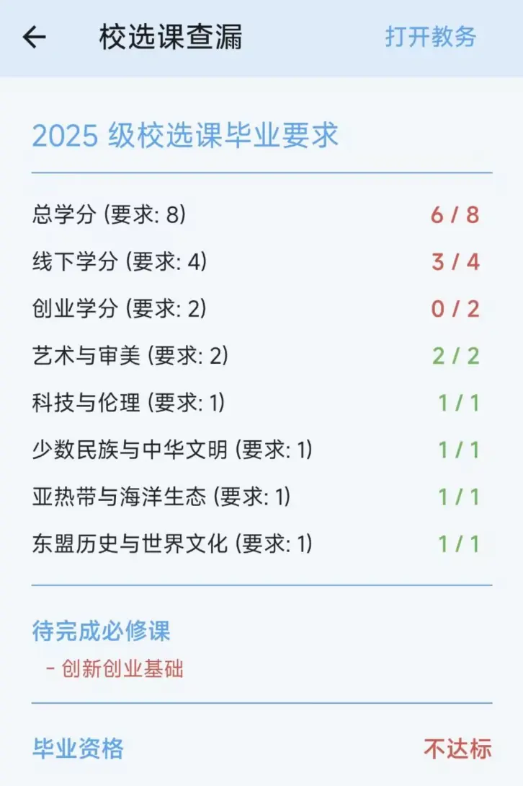

# 校选课查漏

进入工具箱 → 信息查询 → 校选课查漏，是一个计算校选课学分是否达标的功能。

**功能原理：**

此功能会从教务系统获取你已选的校选课信息，结合你的考试成绩（筛选出已及格的课程），自动计算每个校选课板块的学分达标情况。

**页面内容：**

1. **培养方案信息**：根据你的入学年份自动匹配对应的培养方案，显示方案名称
2. **各板块学分统计**：列出每个校选课板块的要求学分和已获得学分，达标项目以绿色标识
3. **待完成必修课**：如有尚未完成的必修课程，会以红色列表显示
4. **毕业资格状态**：页面底部显示当前是否达到毕业资格要求（达标/不达标）
5. **课程成绩列表**：列出所有校选课及其成绩，网课会以特殊图标标记

**颜色含义：**

- 绿色文字：已达标/已通过
- 红色文字：未达标/未通过/已挂科
- 灰色文字「已挂科或未出成绩」：该课程尚无有效成绩记录
