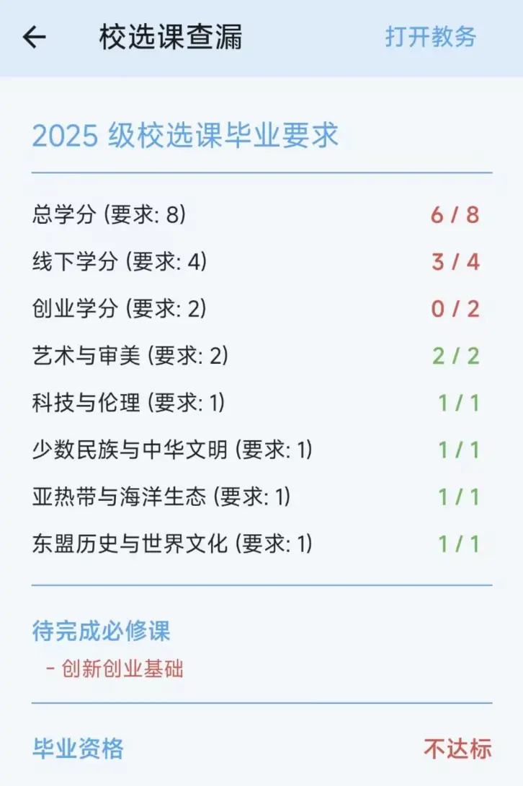

# 课程信息

## 个人课表查询

进入工具箱 → 信息查询 → 课表，可以查询指定学期的个人课表。

**操作步骤：**

1. 进入页面后默认显示当前学期的课表
2. 点击顶部的学期选择器，可以切换学年和学期
3. 左右滑动查看不同周数的课程安排
4. 点击任意课程块查看详细信息

查询结果以与首页日程表相同的形式呈现，支持查看课程详情、教师信息等。

## 班级课表查询

进入工具箱 → 信息查询 → 班级课表，可以查询指定班级相应学期的课表。

**操作步骤：**

1. 选择查询的学年和学期
2. 选择要查询的班级
3. 查看班级课表

查询结果以与首页课程表相同的形式呈现，方便了解同班同学的课程安排或查看其他班级的课表。

## 导出课表

进入工具箱 → 信息查询 → 导出课表，可以将教务系统上的课表页面导出为 HTML 文件，方便保存和分享。

**操作步骤：**

1. 进入页面后，顶部有两个标签页可供切换：
   - **个人课表**：导出自己的个人课表
   - **班级课表**：导出班级课表
2. 页面中间会加载教务系统的课表页面（WebView 内嵌）
3. 等待页面加载完成（底部按钮变为可点击状态）
4. 点击底部「导出课表」按钮
5. 系统会获取页面内容并保存为 HTML 文件，随后自动调用系统打开方式

::: tip 提示
导出的课表是教务系统原始页面的 HTML 文件，可以在浏览器中打开查看。由于是网页形式，保留了原始的排版和样式。
:::

## 物理实验课

进入工具箱 → 实践课 → 物理实验课，能够直接获取到物理实验课的详细信息。

**显示信息：**

- 实验名称
- 上课地点
- 任课教师
- 上课时间

无需登录工程训练中心即可查看相关信息。如果首页日程表中已包含物理实验课信息，也会一并显示在课表中。

## 金工实训

进入工具箱 → 实践课 → 金工实训，能够获取到金工实训的相关信息，免于登录工程训练中心网站查询。

## 选课课程列表

进入工具箱 → 信息查询 → 选课课程列表，能够查询各门课程的选课情况。

**操作步骤：**

1. 输入课程名称关键词（可选，留空则查询全部）
2. 选择课程类型：
   - 主修课程
   - 体育分项
   - 特殊课程
   - 通识选修课
   - 其他特殊课程
3. 点击「查询」按钮

**查询结果说明：**

查询结果按课程分组显示，每门课程的卡片包含：

- **课程代码**：课程的唯一标识
- **课程名称**：课程的中文名称
- **教学班数量**：该课程包含的教学班个数
- **已选人数**：所有教学班的已选课总人数
- **学分**：该课程的学分
- **课程标签**：课程的分类标签（如通识选修课的具体分类）

页面底部会汇总显示：「共有 X 门课程，Y 个教学班」。

## 校选课查漏

进入工具箱 → 信息查询 → 校选课查漏，是一个计算校选课学分是否达标的功能。

**功能原理：**

此功能会从教务系统获取你已选的校选课信息，结合你的考试成绩（筛选出已及格的课程），自动计算每个校选课板块的学分达标情况。

**页面内容：**

1. **培养方案信息**：根据你的入学年份自动匹配对应的培养方案，显示方案名称
2. **各板块学分统计**：列出每个校选课板块的要求学分和已获得学分，达标项目以绿色标识
3. **待完成必修课**：如有尚未完成的必修课程，会以红色列表显示
4. **毕业资格状态**：页面底部显示当前是否达到毕业资格要求（达标/不达标）
5. **课程成绩列表**：列出所有校选课及其成绩，网课会以特殊图标标记

**颜色含义：**

- 绿色文字：已达标/已通过
- 红色文字：未达标/未通过/已挂科
- 灰色文字「已挂科或未出成绩」：该课程尚无有效成绩记录

::: tip 提示
此功能的计算结果基于教务系统中的数据，仅供参考。实际毕业资格以学校教务处审核为准。培养方案可能有调整，系统匹配的方案可能不完全准确。
:::

## GPA 计算器

进入工具箱 → 信息查询 → 考试成绩，查询页面底部有「绩点计算器」按钮，点击可进入 GPA 计算器。

**操作步骤：**

1. 选择要计算的学年和学期（默认显示全部学期）
2. 系统会自动获取该学期的所有成绩数据
3. 页面顶部大字显示计算出的 GPA 值（保留三位小数）
4. 下方列表显示每门课程的数据来源（课程名称）、绩点和学分

**计算方法：**

点击「计算方法」旁的问号图标，可以查看详细的计算公式说明。计算依据为《广西大学普通本科学生课程修读、考核及成绩管理办法（2019年修订）》：

- **课程学分绩点** = （课程考核成绩 ÷ 课程考核满分值 × 100）/ 10 - 5
- 不及格课程的学分绩点为零
- **平均学分绩点** = Σ（课程学分绩点 × 取得的课程学分 × K）/ Σ 修读课程学分
- 其中 K 为课程系数，无特别说明时取值为 1

::: warning 注意
GPA 计算器的计算结果仅供参考，实际绩点以教务系统显示为准。
:::

## 全校实时课表

进入工具箱 → 其他 → 全校实时课表，能够获取到当前时间段内全校各班级正在上课的课表信息。

可用于了解特定时间段各教学楼的课程安排情况，例如查看某栋教学楼是否有空教室。
