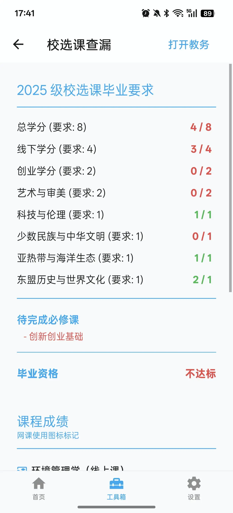

# 课程信息

## 个人课表查询

进入工具箱 → 信息查询 → 课表，可以查询指定学期的个人课表。

按序修改查询参数（学年、学期），查询结果以与首页课程表相同的形式呈现。点击课程可以查看详细信息（上课教室、教师、班级 QQ 群号等）。

## 班级课表查询

进入工具箱 → 信息查询 → 班级课表，可以查询指定班级相应学期的课表。

按序修改查询参数（学年、学期、班级），查询结果以与首页课程表相同的形式呈现。此功能方便了解同班同学的课程安排。

## 导出课表

进入工具箱 → 信息查询 → 导出课表，可以将当前课表导出为图片保存到手机相册。

适合分享课表或在社交平台展示课程安排。

## 物理实验课

进入工具箱 → 实践课 → 物理实验课，能够直接获取到物理实验课的详细信息，包括：

- 上课地点
- 任课教师
- 实验名称
- 上课时间等

无需登录工程训练中心即可查看相关信息。

## 金工实训

进入工具箱 → 实践课 → 金工实训，能够获取到金工实训的相关信息，免于登录工程训练中心网站查询。

## 选课课程列表

进入工具箱 → 信息查询 → 选课课程列表，能够查询校选课的选课情况，例如：

- 选课人数
- 教学班级数
- 选修的学分

方便了解各门课程的选课热度。

## 校选课查漏

进入工具箱 → 信息查询 → 校选课查漏，是一个计算校选课数量是否达标的功能。

**功能说明：**

此功能会从教务系统获取校选课信息并聚合整理，自动计算每个校选课板块的应得学分与已获得学分，帮助学生查漏校选课。

系统会根据你的入学年份自动匹配对应的培养方案要求，并显示：
- 各板块的学分要求和已获得学分
- 待完成的必修课列表
- 毕业资格是否达标的状态

::: tip 提示
此功能的计算结果基于教务系统中的数据，仅供参考。实际毕业资格以学校教务处审核为准。
:::

## GPA 计算器

进入工具箱 → 信息查询 → 考试成绩，查询页面底部有「绩点计算器」按钮，点击可进入 GPA 计算器。

可以手动输入各科成绩和学分，计算加权平均绩点，方便进行学业规划。

## 全校实时课表

进入工具箱 → 其他 → 全校实时课表，能够获取到当前时间段内全校各班级正在上课的课表信息。

可用于查看特定时间段的教学楼使用情况。
