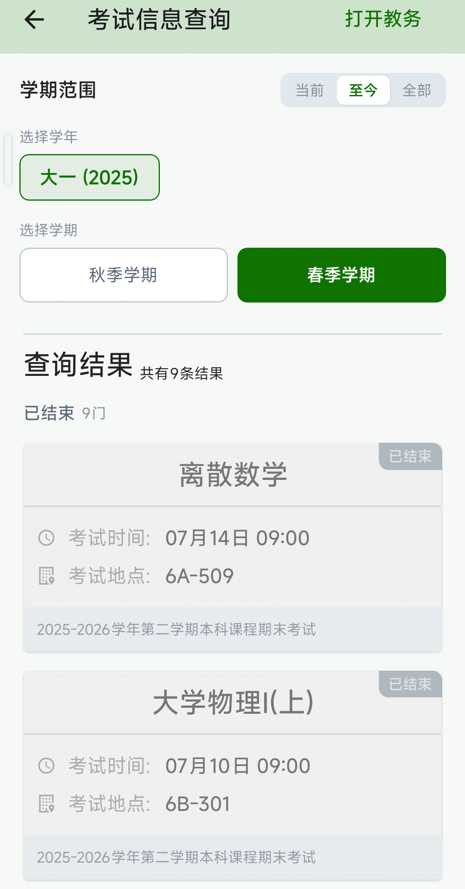

# 考试考场查询

进入工具箱 → 信息查询 → 考试考场，可以查询考试安排和考场信息。

**操作步骤：**

1. 顶部选择查询的学年和学期（默认为当前学期）
2. 系统自动查询并显示考试信息列表
3. 每页显示 15 条记录，可通过底部页码输入框切换页数

**考试状态标签：**

每条考试信息卡片右上角会显示状态标签：

| 标签 | 颜色 | 含义 | 排序规则 |
|------|------|------|----------|
| 即将开考 | 绿色 | 考试尚未开始 | 按时间升序排列（最近的在前） |
| 时间未知 | 黄色 | 考试时间尚未确定 | 排在即将开考之后 |
| 已结束 | 灰色 | 考试已经结束 | 按时间降序排列（最近的在前） |

**考试信息卡片包含：**

- **课程名称**：卡片顶部居中显示，字号较大
- **考试时间**：以时钟图标标识，显示具体考试日期和时间段
- **考试地点**：以建筑物图标标识，显示教室名称
- **座位号**：以座位图标标识（仅未开考的考试显示，已结束的考试不显示座位号）
- **考试类型**：卡片底部灰色小字显示（如「期末考试」等）

**缓存机制：**

查询结果会自动缓存在手机中，下次打开页面时会先显示缓存数据，无需等待网络请求。适合考试前即用即查。

::: tip 提示
考试信息除了在此页面查看外，也会自动同步到首页日程表中，在对应的考试日期显示考试标记。点击日程表中的考试可以查看相同的信息。
:::
