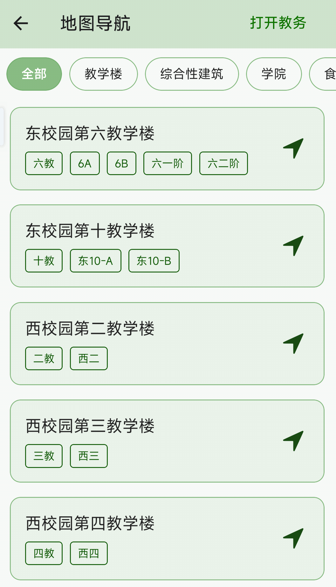

# 地图导航

进入工具箱 → 其他 → 地图导航，可以查看校内地点并导航。

**功能说明：**

- 包含校内绝大部分地点（教学楼、图书馆、食堂、宿舍区、运动场等）
- 地点以列表形式展示
- 点击任意地点后，自动跳转到手机上安装的地图应用（高德地图或百度地图）
- 地图应用会自动输入目的地名称，无需手动搜索

**使用流程：**

1. 在地点列表中找到目标地点
2. 点击该地点
3. 系统检测手机上安装的地图应用
4. 自动打开地图应用并输入地点名称
5. 在地图应用中选择导航方式（步行/骑行/驾车）

::: warning 使用前提
使用地图导航功能前，请确保手机上已安装以下地图应用之一：
- 高德地图
- 百度地图

如未安装，点击地点后可能无法正常跳转。
:::
