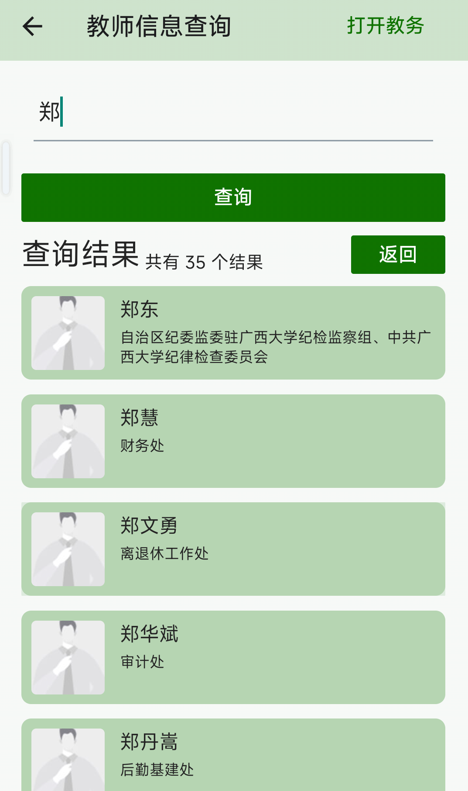

# 教师信息查询

进入工具箱 → 信息查询 → 教师信息查询，可以搜索查询广西大学教师的相关信息。

**两种查询方式：**

  
## 关键词搜索

1. 在顶部搜索框中输入关键词
2. 点击「查询」按钮
3. 查看搜索结果

支持搜索的维度：
- 教师姓名
- 单位名称（如学院名称）
- 职称（如教授、副教授）
- 一级学科

搜索框提示文字：「请输入姓名/单位名称/职称/一级学科」

  
## 按姓氏首字母查询

1. 搜索框下方会显示 A - Z 的字母选择器
2. 点击任意字母，按姓氏首字母筛选教师
3. 查看筛选结果

**搜索结果列表：**

每条教师信息以卡片形式显示：

- **教师照片**：左侧显示教师照片（如无照片则显示默认头像）
- **教师姓名**
- **所属单位**：显示教师所在的学院或部门

**分页加载：**

搜索结果支持无限滚动加载，滑动到底部自动加载下一页。加载时底部显示「加载中...」，没有更多数据时显示「没有更多了」。

**查看教师详情：**

点击任意教师卡片，进入详情页面，可以查看教师的详细信息。

**返回操作：**

在搜索结果页面点击「返回」按钮，回到字母选择器页面，可以继续查询。
